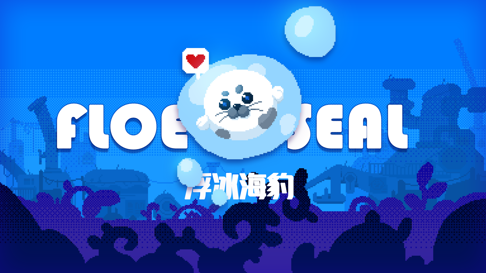
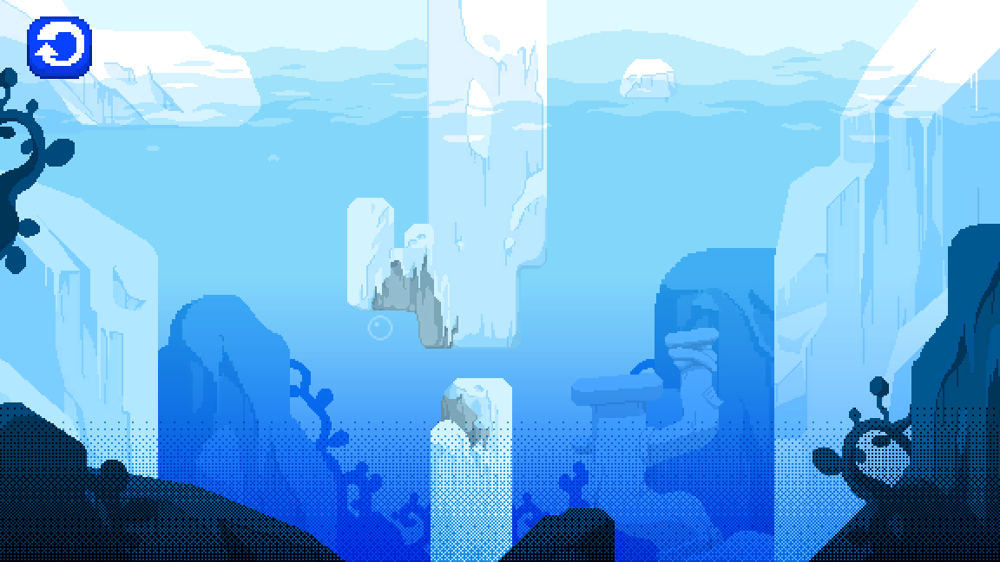

# Floating Ice Seal

<div align="center">



### 在冰海深处，找到回家的路

一款基于 Unity 的 2D 水下平台解谜游戏。控制海豹穿越浮冰与危险水域，利用气泡推进，在氧气耗尽前抵达终点。


</div>

## 目录

- [游戏预览](#游戏预览)
- [核心玩法](#核心玩法)
- [系统设计](#系统设计)
- [技术栈](#技术栈)
- [项目结构](#项目结构)
- [运行项目](#运行项目)

## 游戏预览

| 冰海环境 |
|:---:|
|  |

## 核心玩法

```text
观察环境  ->  调整位置  ->  气泡推进  ->  躲避障碍  ->  抵达终点
				 ^                              |
				 +--------- 管理氧气 <----------+
```

- **水下移动**：在浮冰、狭窄通道和复杂地形之间寻找路线。
- **气泡推进**：通过气泡获得推进力，控制方向与移动节奏。
- **资源管理**：持续关注氧气与生命值，在有限资源下完成关卡。
- **机制解谜**：利用浮冰、水草、铁丝网、尖刺、水雷和木箱等场景物件。
- **失败重置**：关卡状态可恢复，快速重试并验证新的通关路线。

## 系统设计

| 模块 | 负责内容 |
| --- | --- |
| 四套状态机 | Life、Oxygen、Environment、Action，分别管理角色的核心状态 |
| GameEvents | 通过事件总线连接角色、关卡、UI 与流程系统 |
| Information Pool | 统一共享角色状态、关卡进度、存档和运行时数据 |
| MVC UI | 菜单、设置、暂停和存档切换采用 Model / View / Controller 分层 |
| Level Reset | 记录并恢复关卡内动态物体，支持失败后的快速重置 |
| Scene Flow | 管理开始、加载、关卡与结算场景之间的切换 |

## 技术栈

- Unity 2022.3.61f1
- C# / Unity Script
- URP 2D Renderer
- Tilemap + 2D Physics
- uGUI + TextMesh Pro
- Odin Inspector
- State Machine、GameEvents、Information Pool
- MVC UI Framework 与自定义水体检测工具

## 项目结构

```text
Assets/
├── Scenes/              # 开始、加载、关卡与结算场景
├── Scripts/
│   ├── Character/       # 海豹与角色状态
│   ├── Bubble/          # 气泡推进
│   ├── Events/          # 事件系统
│   ├── InformationPool/ # 共享数据
│   ├── MVC/             # UI Model / View / Controller
│   ├── SenceObjects/    # 关卡机制物件
│   ├── GameProcess/     # 游戏流程与存档
│   └── UI/              # 游戏界面
├── Prefabs/
├── Resources/
└── Rendering/
```

## 运行项目

### 环境要求

- Unity Hub
- Unity **2022.3.61f1**

### 启动步骤

1. 使用 Unity Hub 打开项目根目录。
2. 使用 Unity 2022.3.61f1 导入并打开项目。
3. 打开 `Assets/Scenes/StartSence.unity`。
4. 点击 Unity 编辑器顶部的 **Play** 运行游戏。

## 项目重点

这是一个用于实践 Unity 游戏开发与系统设计的个人项目，重点关注：

- 可扩展的角色状态与关卡机制
- 事件驱动的模块通信
- 可恢复、可重试的关卡流程
- UI、存档与运行时数据的分层管理
